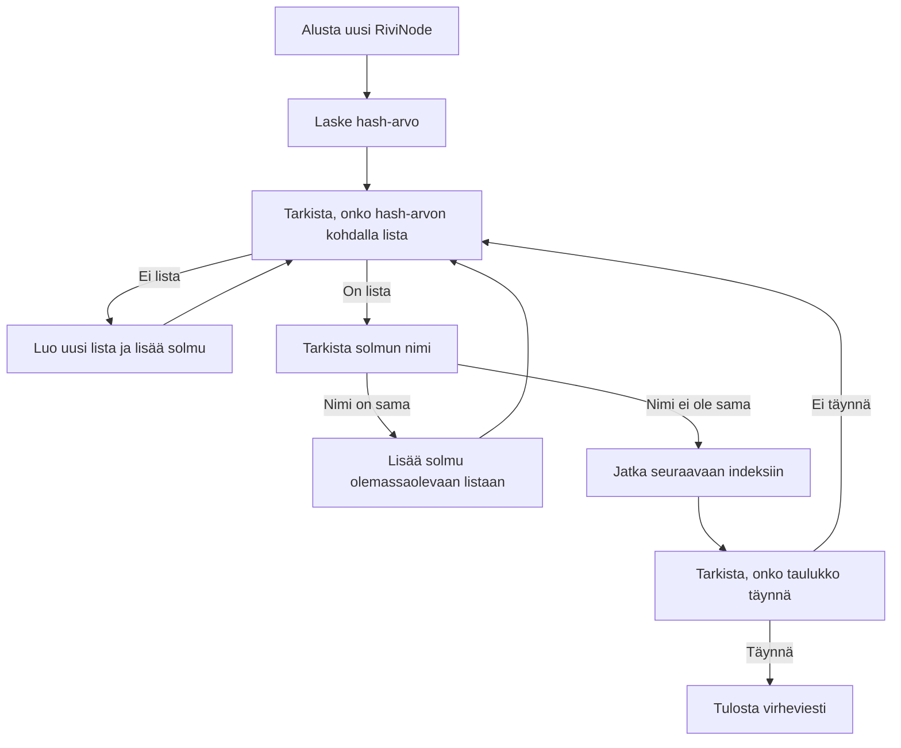

# DSA Final project

Algoritmit ja Tietorakenteet - Kurssin Lopputyö

## Tarkoitus

Tämän ohjelman tarkoituksena on demonstroida hajautustaulun käyttöä ja sen toimintaa. Hajautustaulua käytetään tallentamaan ja indeksoimaan tietoja tietorakenteeseen. Ohjelma lukee tiedostoja, käsittelee niiden tietoja ja tarjoaa toiminnallisuuksia tietojen hakemiseen.

## Tiedonkeruu ja suunnittelu

#### Miksi päädyttiin hajautustauluun?

Aluksi tehtiin avl puu, mutta ei saatu toimimaan kunnolla. 

Kyseltiin tietoa ChatGPT:ltä, että mitä muita vaihtoehtosia hakumenetelmiä olisi ja se antoi idean hajautustaulusta.
Tämän jälkeen hajautustaulu tuntui kiinnostavalta ja nopealta vaihtoehdolta avl puulle.

## Toiminta

#### Tiedoston Lukeminen

Ohjelma lukee CSV-tiedostoja (`csv_reader.c`) ja alustaa sarakkeet sekä rivit niiden perusteella. Sarakkeiden nimet luetaan tiedoston neljännestä rivistä ja rivien tiedot luetaan sen jälkeisistä riveistä. Lukeminen tapahtuu funktioilla `alusta_sarakkeet()`, `alusta_rivi()` ja `alusta_rivit()`.

#### Hajautustaulun Luominen

Funktio `lisaa_rivit_hajautustauluun()`. Jokainen rivi sisältää tiedot, jotka ovat jaettu kategorioihin. Funktio ottaa parametreinaan hajautustaulun osoitteen, rivit, joiden tiedot halutaan lisätä, rivien määrän ja kategorian indeksin, jonka mukaan hajautustaulu järjestetään.

1. **Alustus**: Funktion alussa käydään läpi jokainen annettu rivi.

2. **Hash-arvon laskeminen**: Kullakin rivillä olevasta kategoriasta haetaan arvo, jonka perusteella lasketaan hash-arvo. Hash-arvo lasketaan käyttäen funktiota `laske_hash()`, joka palauttaa merkkijonon hash-arvon ja tämä arvo jaetaan taulukon koon kanssa ottaen huomioon lopputuloksena jäävä jakojäännös.

3. **Uuden solmun luominen**: Luodaan uusi RiviNode-olio ja varataan sille muistia. RiviNode sisältää tiedon rivistä sekä viitteen seuraavaan solmuun.

4. **Nimen asettaminen**: Uuden solmun nimeksi asetetaan kategorian arvo.

5. **Tarkistus olemassaolosta**: Tarkistetaan, onko hash-arvon kohdalla jo olemassa lista. Jos ei, uusi solmu lisätään suoraan kyseisen hash-arvon indeksiin.

6. **Käsittele konfliktit**: Jos hash-arvon kohdalla on jo lista, tarkistetaan jokainen indeksi vuorollaan, kunnes löydetään joko vapaa indeksi tai löydetään solmu, jonka nimi vastaa lisättävän solmun nimeä.

7. **Vapaa indeksi**: Jos löydetään vapaa indeksi, uusi solmu lisätään siihen.

8. **Sama nimi**: Jos löydetään solmu, jonka nimi vastaa lisättävän solmun nimeä, uusi solmu lisätään sen perään.

9. **Taulukko täynnä**: Jos kaikki indeksit on tarkistettu eikä sopivaa paikkaa löydy, tulostetaan virheilmoitus.

10. **Tulostus**: Lopuksi tulostetaan viesti "Rivit lisätty hajautustauluun", kun kaikki rivit on lisätty onnistuneesti.

### Hajautustaulun toimintakaavio:

#### Toiminnallisuudet

Ohjelma tarjoaa seuraavia toiminnallisuuksia käyttäjälle:

- Arvon haku hajautustaulusta (hae_arvoa_hajautustaulusta)
- Erilaisten arvojen laskeminen hajautustaulusta (laske_erilaiset_arvot)

Muut toiminnallisuudet mitä ohjelma sisältää (ei käyttäjälle):

- Hajautustaulun uudelleenjako (jaa_hajautustaulu_uudelleen)
- Erilaisten arvojen näyttäminen karsituista (nayta_erilaiset_arvot_karsituista)
- ArvoJnr-listan luominen (luo_arvojnr_listasta)

#### Pääohjelma

Pääohjelma (main.c) käynnistää ohjelman ja tarjoaa käyttöliittymän, josta käyttäjä voi valita haluamansa toiminnallisuuden.

## Käyttö

1. Käynnistä ohjelma ja valitse haluamasi toiminto.
2. Noudata ohjeita näytöllä.

### ! HUOMIOITAVAA !

    ! Ohjelma on suunniteltu toimimaan CSV-tiedostojen kanssa.
    ! Tiedoston lukemiseen ja hajautustaulun käyttöön on toteutettu erilliset moduulit.
    ! Hajautustaulun koon (HASH_TAULUN_KOKO) muuttaminen voi vaikuttaa ohjelman suorituskykyyn.

## Yhteenveto
