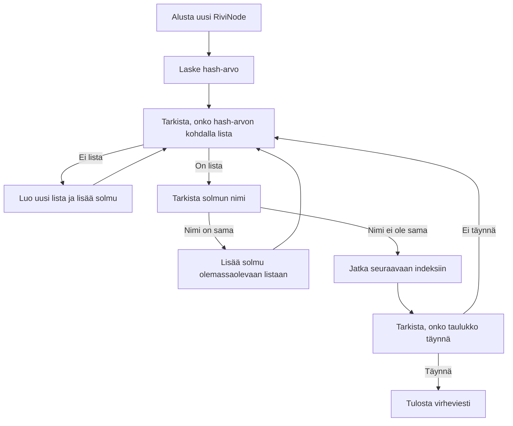
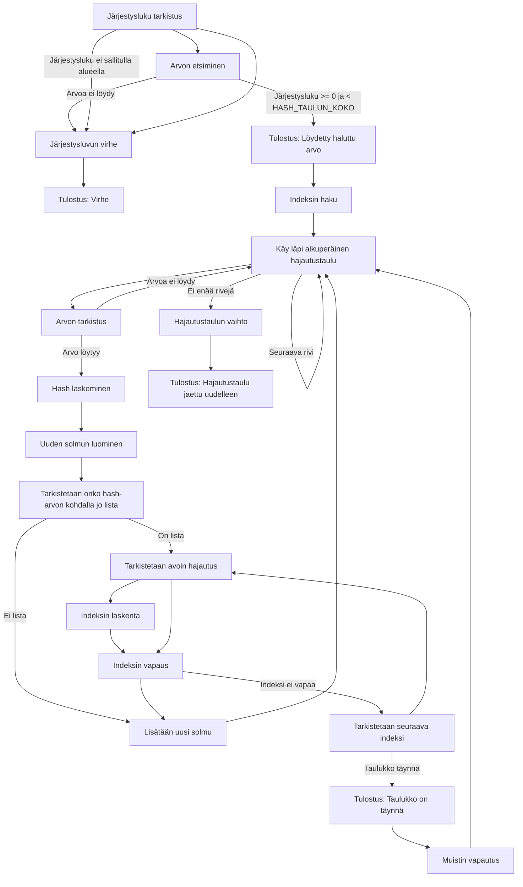

# DSA Final project

Algoritmit ja Tietorakenteet - Kurssin Lopputyö

## Tarkoitus

Tämän ohjelman tarkoituksena on demonstroida hajautustaulun käyttöä ja sen toimintaa. Hajautustaulua käytetään tallentamaan ja indeksoimaan tietoja tietorakenteeseen. Ohjelma lukee tiedostoja, käsittelee niiden tietoja ja tarjoaa toiminnallisuuksia tietojen hakemiseen.

## Tiedonkeruu ja suunnittelu

#### Miksi päädyttiin hajautustauluun?

Aluksi tehtiin avl puu, mutta ei saatu toimimaan kunnolla. 

Kyseltiin tietoa ChatGPT:ltä, että mitä muita vaihtoehtosia hakumenetelmiä olisi ja se antoi idean hajautustaulusta.
Tämän jälkeen hajautustaulu tuntui kiinnostavalta ja nopealta vaihtoehdolta avl puulle.

## Toiminta

#### Tiedoston Lukeminen

Ohjelma lukee CSV-tiedostoja (`csv_reader.c`) ja alustaa sarakkeet, sekä rivit niiden perusteella. Sarakkeiden nimet luetaan ja tallennetaan Sarake rakenteeseen. Lukeminen tapahtuu funktioilla `alusta_sarakkeet()`. Tätä rakennetta käytetään aina kun ohjelmassa tarvitaan sarakkeiden nimiä. Rivien tiedot luetaan ja tallennetaan Rivi rakenteisiin `alusta_rivi()` funktiolla. Jokainen rivirakenne sisältää yhden rivin tiedot, Rakenteessa olevassa listassa on arvot on alkioihin eli jokaiseen arvoon päästään käsiksi samalla indeksillä, joka on myös, sarakkeella. Rivi rakenteet tallennetaan vielä yhdeksi isoksi rakenteeksi, joka sisältää kaikki Rivi rakenteet. Tämä tehdään funktiolla `alusta_rivit()`.

#### Hajautustaulun Luominen

Ensin hajautustaulu alustetaan ja sille varataan muistia dynaamisesti funktiolla `luo_hajautustaulu()`ja alustetaan arvolla 0. Hajautustaulun koko on staattinen 160, joka on mitoitettu niin, että se toimisi tehokkaasti jaettaessa rivit alueen perusteella. Eri alueita on käytettävässä csv-tiedostossa 77, joten taulun koon ollessa kaksin kertainen tulee vähemmän törmäyksiä, jolloin lisäys ja haku on nopeampia. Ensimmäisellä kerralla Rivit lisätään tauluun funktiolla `lisaa_rivit_hajautustauluun()`. Funktio ottaa parametreinaan hajautustaulun osoitteen, rivit rakenteen, joka sisältää kaikki tiedostosta tallennetut rivit, rivien määrän ja käyttäjän antaman kategorian indeksin, jonka mukaan hajautustaulu järjestetään.

## Hajautustauluun lisääminen ensimmäisellä kierroksella

1. **Hash-arvon laskeminen**:
Haetaan riviltä käyttäjän antamasta indeksistä arvo, jonka perusteella lasketaan hash-arvo. Hash-arvo lasketaan käyttäen funktiota `laske_hash()`, joka palauttaa merkkijonon hash-arvon ja tämä arvo jaetaan taulukon koon kanssa ottaen huomioon lopputuloksena jäävä jakojäännös. Hash-arvon laskeminen tapahtuu bittitasolla ja tarkempi toiminta on kommentoitu funktion yhteyteen.

2. **Uuden solmun luominen**:
Koska jokainen hashtaulun indeksi sisältää linkitetyn lista kaikista riveistä, joilla on tämä arvo tietyssä indeksissä. Luodaan uusi RiviNode-olio ja varataan sille muistia. RiviNode sisältää tiedon rivistä sekä viitteen seuraavaan solmuun. 

3. **Nimen asettaminen**:
Uuden solmun nimeksi asetetaan kategorian nimi.

4. **Tarkistus olemassaolosta**:
Tarkistetaan, onko hash-arvon kohdalla jo olemassa lista. Jos ei, uusi solmu lisätään suoraan kyseisen hash-arvon indeksiin.

5. **Käsittele konfliktit**:
Jos hash-arvon kohdalla on jo lista, tarkistetaan onko ensimmäisen solmun nimi sama, kun sillä solmulla jota yritetään lisätä.

7. **Sama nimi**:
Jos löydetään solmu, jonka nimi vastaa lisättävän solmun nimeä, uusi solmu lisätään sen perään.

8. **eri nimi**:
Jos nimi ei ole sama siirrytään indeksissä yhdellä eteenpäin. Tarkistetaan uudelleen.

9. **Taulukko täynnä**:
Jos kaikki indeksit on tarkistettu eikä sopivaa paikkaa löydy, tulostetaan virheilmoitus.

10. **Tulostus**:
Lopuksi tulostetaan viesti "Rivit lisätty hajautustauluun", kun kaikki rivit on lisätty onnistuneesti.

### Hajautustaulun toimintakaavio ensimmäisellä haulla:

## Erilaisten arvojen tallentaminen rakenteeseen:
Ohjelman käyttämisen helpottamiseksi luodaan lista rakenteista käymällä läpi kaikki hajautustaulun indeksit ja
otetaan niistä talteen solmun arvo, järjestysnumero sekä tallennusindeksi ja tallennetaan ne ArvoJnr-rakenteeseen. Tähän käytetään funktiota `luo_arvojnr_listasta()`.

Tämä mahdollistaa sen, että käyttäjä voi valita listasta haluamansa arvon järjestysnumeron perusteella.

Koska rakenteeseen tallennetaan myös hajautustaulun tallennusindeksi niin sitä voidaan käyttää, kun haetaan tiettyä arvoa hajautustaulusta. Tämä nopeuttaa hakutoimintaa O(1). 

## Hajautustauluun lisääminen seuraavilla kierroksilla:

1. **Alustetaan uusi hajautustaulu**:
Tämä tehdään funktiolla `luo_uusi_hajautustaulu()`.

1. **Järjestysluku tarkistus**:
Tarkistetaan, että haluttu järjestysluku on sallitulla alueella.

2. **Arvon etsiminen**:
Jos järjestysluku on sallitulla alueella, etsitään vastaava arvo annetulla järjestysluvulla ArvoJnr-rakenteesta.

3. **Tulostus: Löydetty haluttu arvo**:
Jos haluttu arvo löytyy, se tulostetaan yhdessä järjestysluvun kanssa.

4. **Indeksin haku**:
Seuraavaksi funktio käy läpi alkuperäisen hajautustaulun vain annetun indeksin solmut.

5. **Arvon tarkistus**:
Jokaisen solmun kohdalla tarkistetaan, onko haluttu arvo olemassa annetusta sarakkeesta.

6. **Hash laskeminen**:
Mikäli arvo on olemassa, lasketaan sen perusteella uusi hajautusindeksi.

7. **Uuden solmun luominen**:
Luodaan uusi solmu ja lisätään se hajautustauluun samalla tavalla, kuin ensimmäisellä kerralla käyttäen samoja konfliktinhallintamenetelmiä.

8. **Taulukko täynnä**:
Varmistetaan, ettei hajautustaulu ole täynnä, ja tarvittaessa tulostetaan virheilmoitus.

9. **Hajautustaulun vaihto**:
Lopuksi vaihdetaan alkuperäisen hajautustaulun osoitin uuteen hajautustauluun.

10. **Tulostus: Hajautustaulu jaettu uudelleen**:
Funktio tulostaa viestin hajautustaulun onnistuneesta uudelleen jakamisesta.

### Hajautustaulun toimintakaavio seuraavilla kierroksilla:

#### Toiminnallisuudet

Ohjelma tarjoaa seuraavia toiminnallisuuksia käyttäjälle:

- Arvon haku hajautustaulusta (`hae_arvoa_hajautustaulusta()`)
- Erilaisten arvojen laskeminen hajautustaulusta (`laske_erilaiset_arvot()`)

Muut toiminnallisuudet mitä ohjelma sisältää (ei käyttäjälle):

- Hajautustaulun uudelleenjako (`jaa_hajautustaulu_uudelleen()`)
- Erilaisten arvojen näyttäminen karsituista (`nayta_erilaiset_arvot_karsituista()`)
- ArvoJnr-listan luominen (`luo_arvojnr_listasta()`)

#### Pääohjelma

Pääohjelma (`main.c()`) käynnistää ohjelman ja tarjoaa käyttöliittymän, josta käyttäjä voi valita haluamansa toiminnallisuuden.

## Käyttö

1. Käynnistä ohjelma ja valitse haluamasi toiminto.
2. Noudata ohjeita näytöllä.

### ! HUOMIOITAVAA !

    ! Ohjelma on suunniteltu toimimaan CSV-tiedostojen kanssa.
    ! Tiedoston lukemiseen ja hajautustaulun käyttöön on toteutettu erilliset moduulit.
    ! Hajautustaulun koon muuttaminen voi vaikuttaa ohjelman suorituskykyyn.

## Yhteenveto
