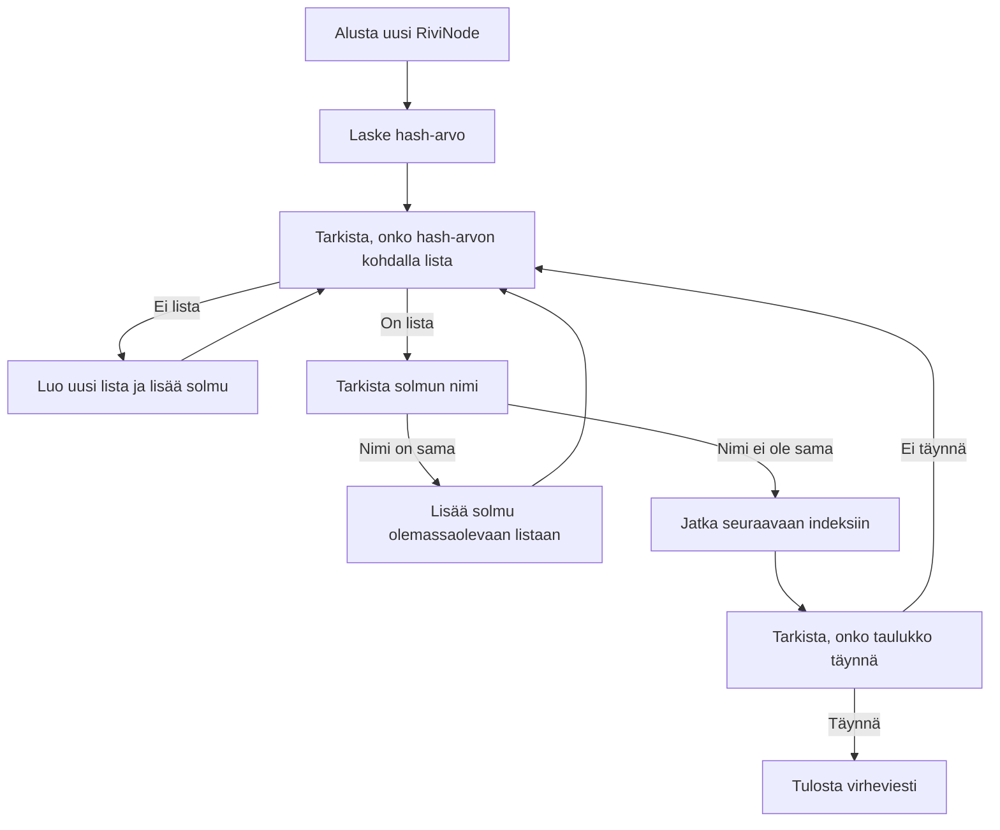

```mermaid
graph TD;
    A[Alusta uusi RiviNode] --> B[Laske hash-arvo];
    B --> C[Tarkista, onko hash-arvon kohdalla lista];
    C --> |Ei lista| D[Luo uusi lista ja lisää solmu];
    C --> |On lista| E[Tarkista solmun nimi];
    E --> |Nimi on sama| F[Lisää solmu olemassaolevaan listaan];
    E --> |Nimi ei ole sama| G[Jatka seuraavaan indeksiin];
    G --> H[Tarkista, onko taulukko täynnä];
    H --> |Ei täynnä| C;
    H --> |Täynnä| I[Tulosta virheviesti];
    F --> C;
    D --> C;

```