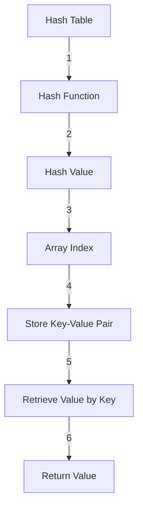

```mermaid
graph TD;
    A[Hash Table] -->|1| B[Hash Function];
    B -->|2| C[Hash Value];
    C -->|3| D[Array Index];
    D -->|4| E[Store Key-Value Pair];
    E -->|5| F[Retrieve Value by Key];
    F -->|6| G[Return Value];

```